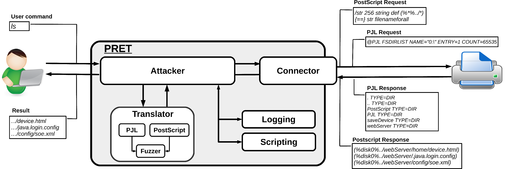
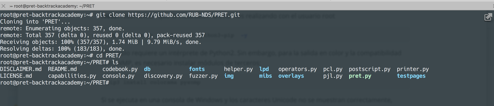
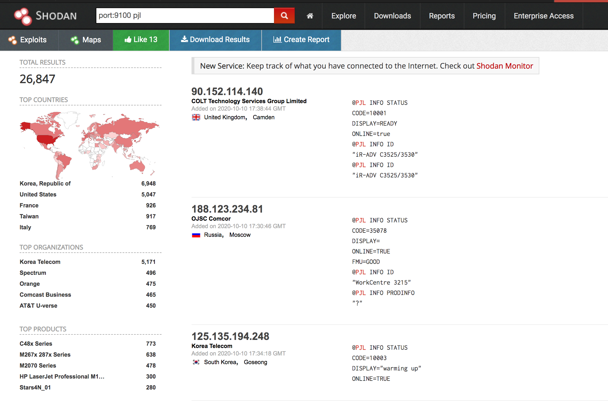
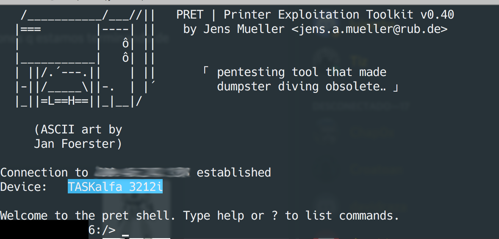
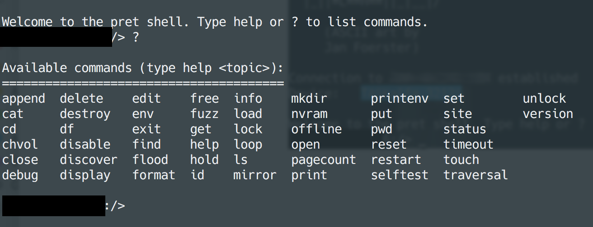

# Printer Exploitation Toolkit

Han pasado casi 3 años desde que el hacker conocido como [@0xGiraffe](https://twitter.com/0xGiraffe) revoluciona las redes con sus mensajes en apoyo del famoso youtuber [PewDiePie](https://www.youtube.com/user/PewDiePie) y aún a pesar de ello al realizar una simple búsqueda en shodan encontramos expuestos aproximadamente 26,000 impresoras expuestas, sin ningún tipo de autenticación o seguridad alguna. 

El siguiente escrito vamos a replicar la búsqueda utilizando la herramienta [PRET](https://github.com/RUB-NDS/PRET), la cual es una herramienta para probar la seguridad en las impresoras, la misma fue desarrollada en una tesis de Maestría en la Universidad de Ruhr Bochum en Alemania. 

Soporta PostScript, PJL y PCL lenguajes utilizados por la mayoría de las impresoras lasers permitiendo cosas interesantes como capturar o manipular trabajos de impresión, acceder al sistema de archivos y la memoria de la impresora o incluso causar daños físicos al dispositivo.



**Diagrama Arquitectura PRET**


#### Requerimientos 

* Utilizaremos una VPS del proveedor [vultr.com](https://www.vultr.com/?ref=8403796-6G) con ubuntu server 18.04 
* La versión de la herramienta utiliza python2
* Debemos tener instalado pip e actualizar los repositorios
* Una cuenta de shodan académica o pagada 


1. #### Instalación 

   Actualizamos e instalamos pip. 

   **Nota:** recordamos que la instalación la estamos realizando con el usuario root

   ```shell
    apt update && apt install python-pip  -y
   ```

   PRET solo requiere un intérprete de Python2. Sin embargo, para la salida en color y la compatibilidad con SNMP, es necesario instalar módulos de terceros:

   ```shell
   pip install colorama pysnmp
   ```

   Si se ejecuta en una consola de Windows y los caracteres Unicode no se muestran correctamente, instale el módulo win_unicode_console

   ```shell
   pip install win_unicode_console
   ```

   Para la impresión experimental "sin controladores" (consulte el comando de impresión), es necesario instalar ImageMagick y GhostScript:

   ```shell
   apt-get install imagemagick ghostscript -y
   ```

   Procedemos a clonar el repositorio de PRET

   ```
   git clone https://github.com/RUB-NDS/PRET.git
   ```

   

2. Búsqueda de objetivos 

   Vamos a  shodan y realizamos la siguiente consulta: 

   **port:"9100" pjl**

   https://www.shodan.io/search?query=port%3A9100+pjl+

   

   **Nota:** decidimos no censurar el resultado de la búsqueda  porque todo esta expuesto libremente y es una mala configuración de seguridad ampliamente conocida.

3. Seleccionamos el objetivo

   Vamos a utiliza el comando de la siguiente manera 

   ```shell
   /pret.py laserjet.lan pjl
   ```

   

Observamos la lista de comandos disponibles




#### Conclusiones

* Nuevamente comprobamos el error humano dado al exponer estos dispositivos a internet.

* Por defecto no trae ningún tipo de autenticación ni siquiera credenciales básicas, no debemos subestimar esta vulnerabilidad. 

* Pueda permitir movimientos laterales a otras zonas.

* Lanzar ataques de DDOS

  

#### Referencias

* Brewster, T. (2018, 3 diciembre). A Hacker Forced 50,000 Printers To Spread PewDiePie Propaganda -- And The Problem Is Much Bigger Than You Know. Forbes. https://www.forbes.com/sites/thomasbrewster/2018/12/03/a-hacker-forced-50000-printers-to-spread-pewdiepie-propagandaand-the-problem-is-much-bigger-than-you-know/#11eb2dac3819

* Cimpanu, C. (2017, 5 febrero). A Hacker Just Pwned Over 150,000 Printers Left Exposed Online. BleepingComputer. https://www.bleepingcomputer.com/news/security/a-hacker-just-pwned-over-150-000-printers-left-exposed-online/

  